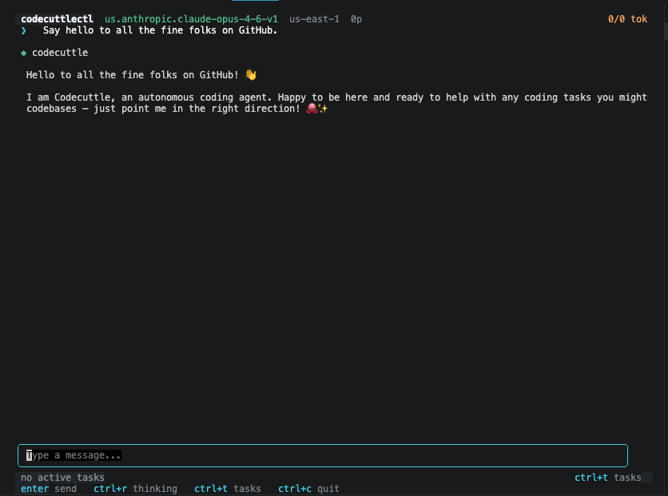

# codecuttlectl

`codecuttlectl` wraps foundation models with structured tool execution, diagnostic feedback loops, and conditional knowledge injection. It's the control binary for the Codecuttle meta-harness.

**Early alpha.** Phases 1-3 of the PoC plan are implemented. Routing engine, Optic Lobe memory, fleet telemetry, swarm orchestration, and self-evolving harness code are future work.



## Context

Lee et al. ("Meta-Harness: End-to-End Optimization of Model Harnesses", 2026) showed that the harness around a fixed LLM — context construction, tool orchestration, memory, state — produces a 6x performance gap on identical benchmarks. Giving an agent full access to prior execution traces enables iterative harness optimization.

We're building toward that. The Inkwell captures execution traces. The skills system ships versioned knowledge with tools. The proto contract defines a stable interface. The intent is for the system to eventually guide production of its own plugins in a versioned, iterative swarm loop.

## Install

```bash
make all
sudo cp bin/codecuttlectl /usr/local/bin/codecuttlectl
sudo mkdir -p /usr/local/lib/codecuttlectl/plugins
sudo cp bin/plugins/* /usr/local/lib/codecuttlectl/plugins/
echo 'alias c3="codecuttlectl -plugin-dir /usr/local/lib/codecuttlectl/plugins"' >> ~/.bashrc
```

## Usage

```bash
c3                              # TUI
c3 -no-tui                      # Streaming REPL
c3 -message "Fix the build"    # One-shot
c3 --session ses_abc123         # Resume
c3 --list-sessions              # Recent sessions
c3 -thinking                    # Extended reasoning
```

## Architecture

Named after cephalopod neurology. A cuttlefish distributes 60% of its neurons into peripheral arm clusters that solve problems locally. The software mirrors this: tool execution happens in isolated plugin subprocesses, not the central model.

| Subsystem | Status |
|-----------|--------|
| **Cuttlebone Substrate** — protobuf + gRPC plugin interface | Done |
| **Inkwell** — error classification + reconciliation loop | Done |
| **Skills Registry** — conditional knowledge injection | Done |
| **Sessions** — persistence, resume, Inkwell capture | Done |
| **Typed Schema** — auto-derived JSON Schema from Go structs | Done |
| **Scaffold Generator** — plugin stub generation mid-session | Done |
| **Work Backlog** — cross-session deferred intent queue | Designed |
| **Chromatophore Engine** — Chomsky hierarchy routing | Planned |
| **Optic Lobe** — PostgreSQL + pgvector + AGE memory | Planned |
| **Arm Nodes** — edge inference agents | Planned |

## Tools

17 total (12 plugin, 5 built-in):

`read_file` `write_file` `edit_file` `list_directory` `bash_exec` `grep` `glob` `git` `go_skills` `websearch` `webfetch` `github` `todo_manage` `tool_info` `get_skill` `scaffold_plugin` `reload_plugins`

## Plugins

Standalone gRPC binaries. Drop a `cuttlebone-*` binary in the plugin directory, discovered on next launch (or mid-session via `reload_plugins`). Any language. Plugins ship embedded skills (versioned Markdown) that activate based on context triggers.

Plugin inputs are defined as annotated Go structs with JSON Schema auto-derived at startup:

```go
type myInput struct {
    Query   string        `json:"query" jsonschema:"required" jsonschema_description:"Search query"`
    Limit   types.FlexInt `json:"limit,omitempty" jsonschema_description:"Max results"`
}

// In Describe():
InputSchema: schema.MustSchema(&myInput{}),
```

New plugins can be scaffolded mid-session via the `scaffold_plugin` tool — generates a buildable stub with typed inputs, schema derivation, and proper boilerplate.

Crash recovery, execution timeouts, input validation, auto-restart. See [`docs/writing-plugins.md`](docs/writing-plugins.md).

## Sessions + Inkwell

Conversations persist to `~/.local/share/codecuttlectl/sessions/`. Every tool execution recorded with timing, error classification, full I/O. The reconciler injects corrective prompts when failures are detected. Zero overhead when things work.

See [`docs/sessions-and-inkwell.md`](docs/sessions-and-inkwell.md).

## Not yet implemented

- Chomsky routing (dynamic complexity classification)
- Optic Lobe (cross-session semantic memory)
- Work Backlog (cross-session deferred intent queue — [design doc](docs/backlog.md))
- Fleet telemetry (OpenTelemetry)
- Swarm orchestration
- Self-evolving harness (outer loop from execution traces)
- Proto-based schema path (cross-language plugin inputs via .proto)
- MicroVM isolation (Firecracker)
- Hot-reload plugins (fsnotify-based auto-discovery)

## Development

```bash
make all     # Build orchestrator + 12 plugins
make test    # 76 tests, 7 packages
make proto   # Regenerate protobuf
```

## License

See [LICENSE](LICENSE).
