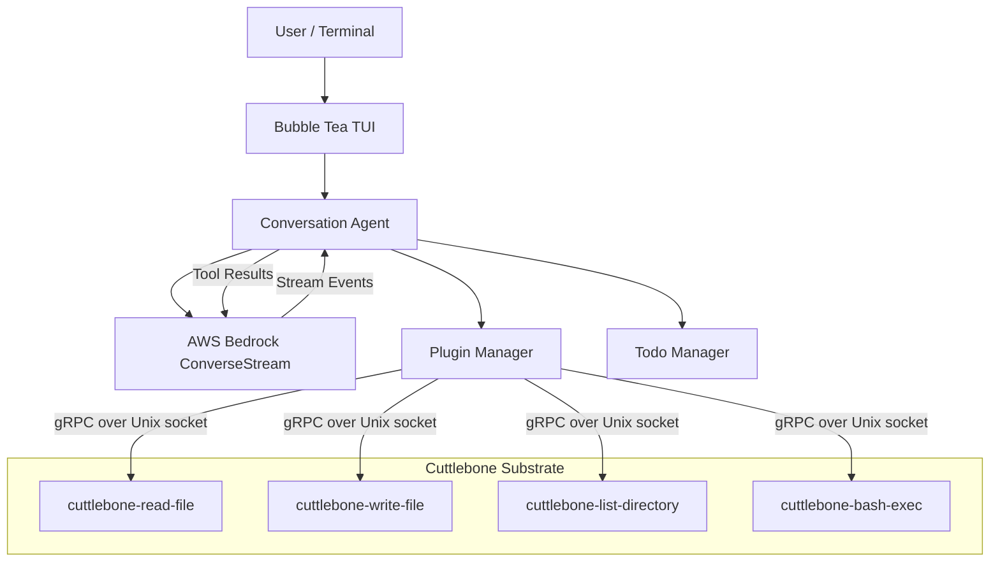
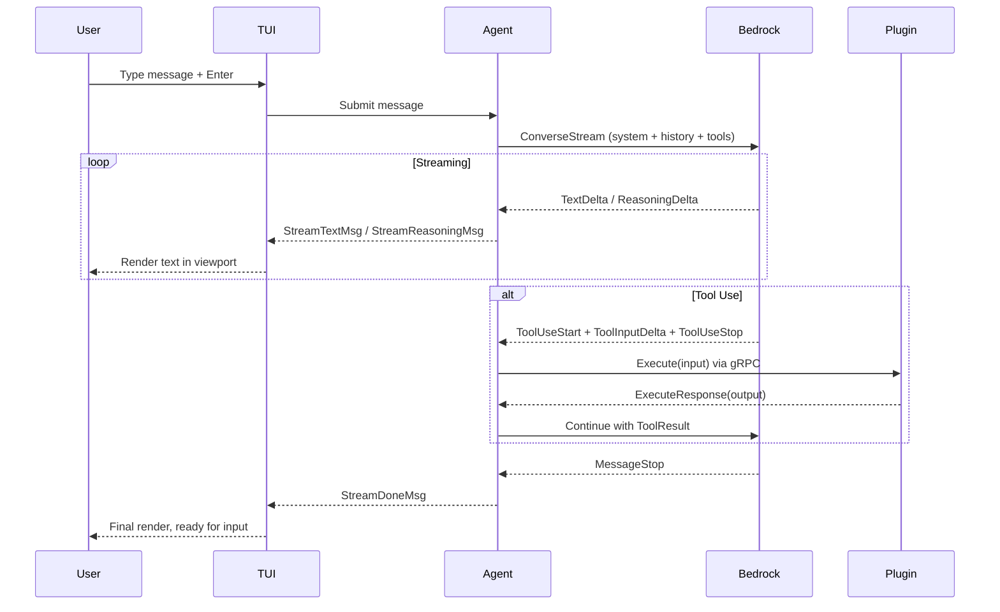
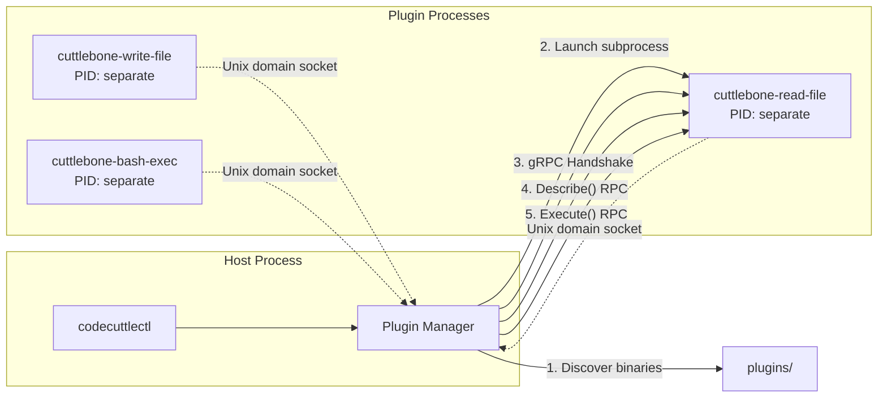
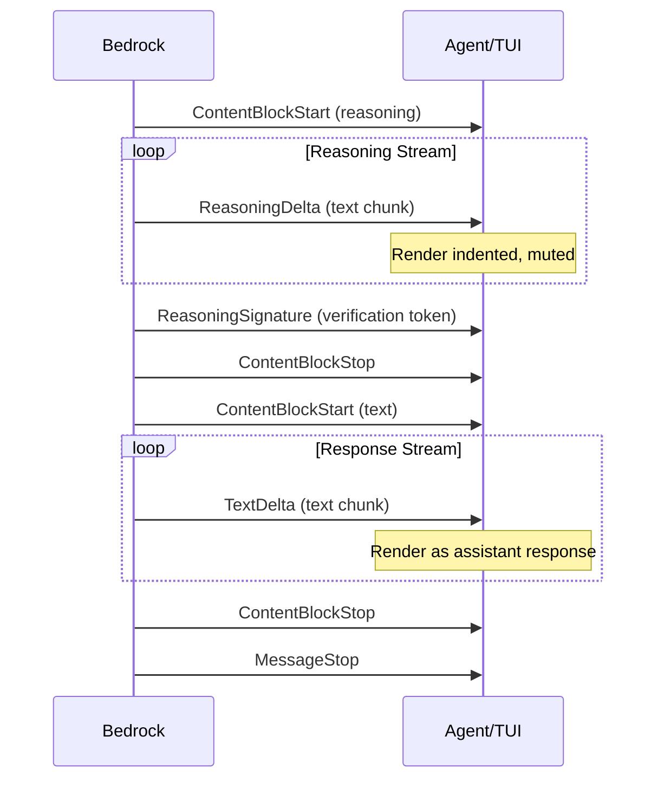

# Architecture

## System Overview



## Conversation Flow



## Plugin Architecture (Cuttlebone Substrate)



## Naming

The architecture draws from cephalopod biology. The one subsystem that's implemented and named today:

- **Cuttlebone Substrate** — The rigid internal shell of a cuttlefish provides compressive strength to an otherwise soft-bodied organism. In the software, the Cuttlebone Substrate is the compiled protobuf + gRPC layer that enforces strict type safety between the orchestrator and its tool plugins, preventing the LLM from invoking malformed tool calls.

## TUI Layout

```
┌─────────────────────────────────────────────────────────┐
│  codecuttlectl | model | region | plugins     in:X out:X│ Status Bar
├─────────────────────────────────────────────────────────┤
│  ▶ user message (highlighted background)                │
│                                                         │
│    💭 thinking... (muted, indented)                     │ Viewport
│                                                         │ (scrollable)
│  ◆ assistant response                                   │
│  ⚡ Calling tool_name...                                │
│  ✓ tool result                                          │
├─────────────────────────────────────────────────────────┤
│  ╭──────────────────────────────────────────────────╮   │
│  │ input area                                       │   │ Input
│  ╰──────────────────────────────────────────────────╯   │
├─────────────────────────────────────────────────────────┤
│  2/5 done · 1 active · 2 pending          ctrl+t expand│ Todo Bar
├─────────────────────────────────────────────────────────┤
│  ↑↓ scroll  enter send  ctrl+r thinking  ctrl+c quit   │ Help Bar
└─────────────────────────────────────────────────────────┘
```

## Data Flow: Extended Thinking

When `--thinking` is enabled:



The reasoning signature is stored for multi-turn continuity — Bedrock requires it when sending previous reasoning context back.
