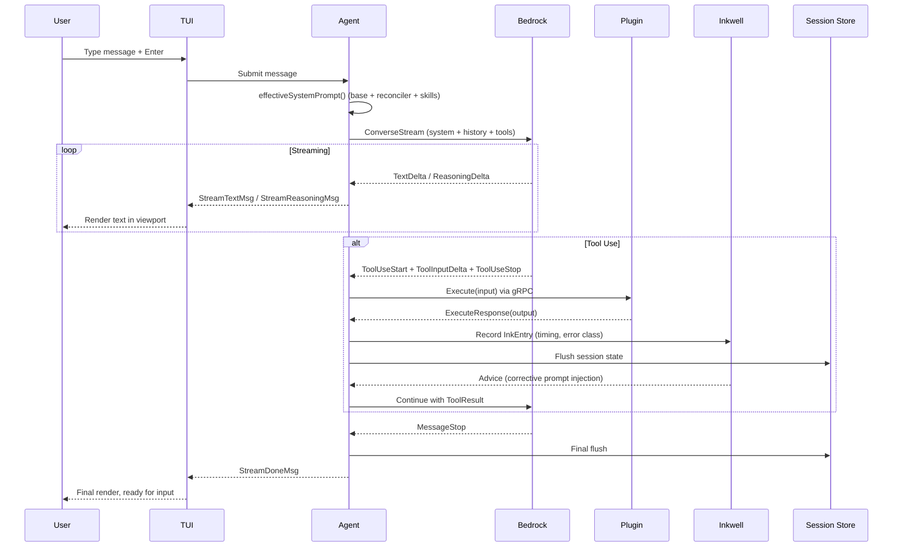
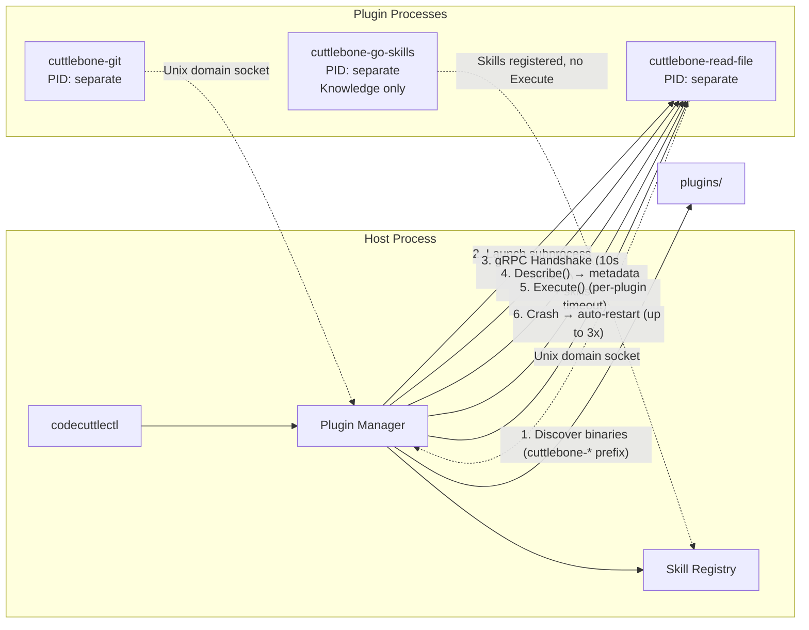
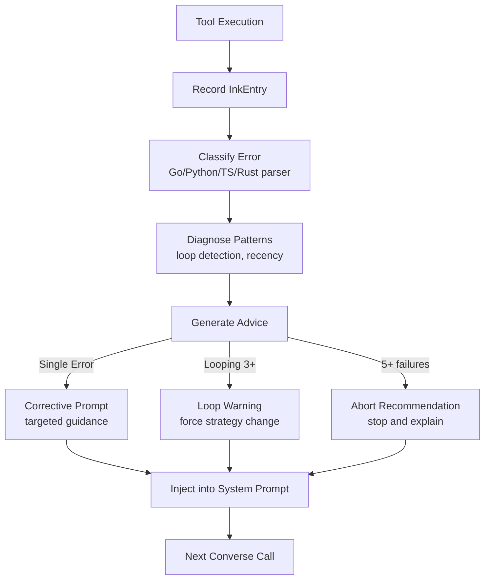
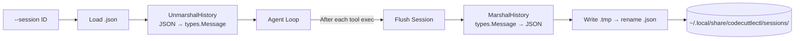
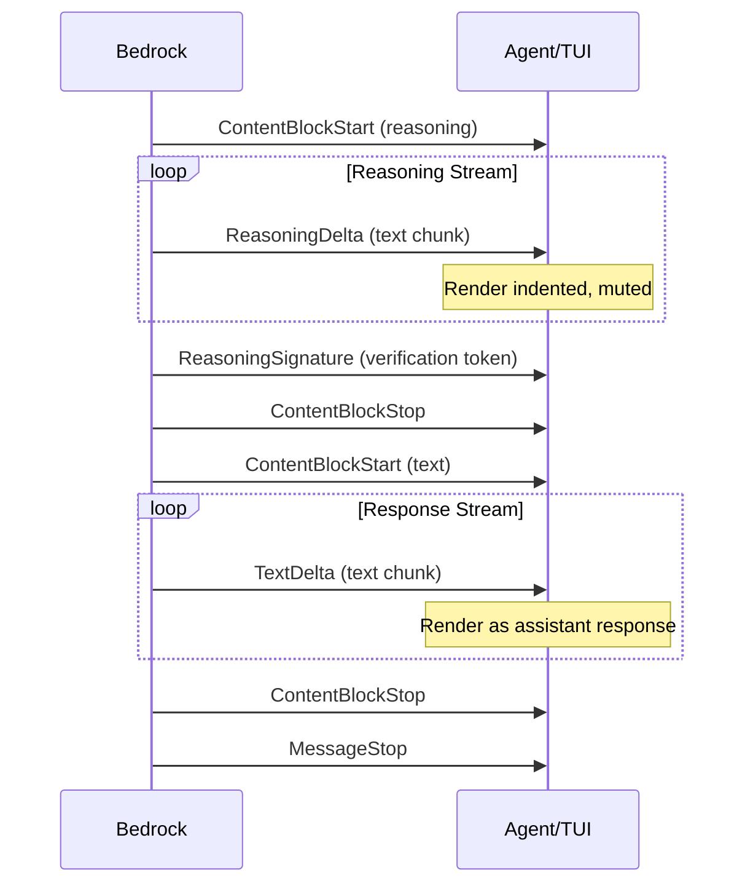

# Architecture

## System Overview

```mermaid
graph TD
    User[User / Terminal] --> TUI[Bubble Tea TUI]
    User --> REPL[Plain REPL / One-shot]
    TUI --> Agent[Conversation Agent]
    REPL --> Agent
    Agent --> ProviderIF[Provider Interface]
    ProviderIF --> Bedrock[AWS Bedrock ConverseStream]
    ProviderIF --> Google[Google AI Gemini]
    ProviderIF --> Ollama[Ollama Local Models]
    Agent --> PluginMgr[Plugin Manager]
    Agent --> TodoMgr[Todo Manager]
    Agent --> StateDict[State Dictionary]
    Agent --> AutoPlan[Auto-Planner]
    Agent --> Inkwell[Inkwell Reconciler]
    Agent --> SkillReg[Skill Registry]
    Agent --> Sessions[Session Store]

    PluginMgr --> |gRPC over Unix socket| P1[cuttlebone-read-file]
    PluginMgr --> |gRPC over Unix socket| P2[cuttlebone-write-file]
    PluginMgr --> |gRPC over Unix socket| P3[cuttlebone-edit-file]
    PluginMgr --> |gRPC over Unix socket| P4[cuttlebone-bash-exec]
    PluginMgr --> |gRPC over Unix socket| P5[cuttlebone-grep]
    PluginMgr --> |gRPC over Unix socket| P6[cuttlebone-glob]
    PluginMgr --> |gRPC over Unix socket| P7[cuttlebone-git]
    PluginMgr --> |gRPC over Unix socket| P8[cuttlebone-github]
    PluginMgr --> |gRPC over Unix socket| P9[cuttlebone-list-directory]
    PluginMgr --> |gRPC over Unix socket| P10[cuttlebone-web-fetch]
    PluginMgr --> |gRPC over Unix socket| P11[cuttlebone-web-search]
    PluginMgr --> |gRPC over Unix socket| P12[cuttlebone-go-skills]
    PluginMgr --> |gRPC over Unix socket| P13[cuttlebone-quant]

    Bedrock --> |Stream Events| Agent
    Agent --> |Tool Results| Bedrock

    Inkwell --> |Corrective Prompts| Agent
    SkillReg --> |Conditional Knowledge| Agent
    Sessions --> |Persist/Restore| Disk[(~/.local/share/codecuttlectl/)]

    subgraph "Cuttlebone Substrate"
        P1
        P2
        P3
        P4
        P5
        P6
        P7
        P8
        P9
        P10
        P11
        P12
        P13
    end
```



## Conversation Flow



## Plugin Architecture (Cuttlebone Substrate)



## Inkwell Reconciliation Loop



## Skills System

```mermaid
graph TD
    Plugins[Plugin Discovery] -->|Describe().Skills| Registry[Skill Registry]
    Registry --> Evaluate{Evaluate Triggers}
    
    Context[Session Context<br/>errors, tools, files, language] --> Evaluate
    
    Evaluate -->|"always"| Active[Active Skills]
    Evaluate -->|"on_error:compile"| Active
    Evaluate -->|"on_file:*.go"| Active
    Evaluate -->|"on_loop"| Active
    
    Active --> Budget[Apply Token Budget<br/>24000 default]
    Budget --> Render[Render into System Prompt]
    Render --> Agent[Agent's effectiveSystemPrompt]
    
    Agent2[Agent] -->|"get_skill(name)"| OnDemand[On-Demand Retrieval]
    OnDemand --> Registry
```

### Trigger Expression Syntax

```
always                    — inject every call (subject to budget)
on_request                — only via get_skill tool
on_error:compile          — on specific error class
on_error:*                — on any error
on_tool:bash_exec         — when tool was used recently
on_file:*.go              — when matching file referenced
on_language:python        — when language detected
on_turn:first             — first turn only
on_loop                   — when looping detected

Combined: on_error:compile|on_language:go   (OR logic)
```

## Session Persistence



### Session File Structure

```json
{
  "meta": {
    "id": "ses_abc12345",
    "created_at": "2026-06-01T08:00:00Z",
    "updated_at": "2026-06-01T08:15:00Z",
    "title": "Fix Compile Errors",
    "model": "us.anthropic.claude-opus-4-6-v1",
    "region": "us-east-1",
    "work_dir": "/home/user/project",
    "stats": { "turns": 3, "tool_calls": 7, "input_tokens": 5000, "output_tokens": 2000 }
  },
  "messages": [...],
  "todos": [...],
  "inkwell": [...]
}
```

## Naming

The architecture draws from cephalopod biology:

| Name | Biological Analog | Software Function |
|------|-------------------|-------------------|
| **Cuttlebone Substrate** | Rigid internal shell providing compressive strength | Compiled protobuf + gRPC layer enforcing type safety |
| **Inkwell** | Ink sac defense mechanism | Diagnostic capture and error analysis cache |
| **Chromatophore Engine** | Pigment cells enabling rapid color change | (Future) Dynamic complexity routing via Chomsky Hierarchy |
| **Optic Lobe** | Multi-dimensional visual processing center | (Future) PostgreSQL + pgvector + AGE hybrid memory |
| **Stellate Ganglion** | Peripheral motor center bypassing the brain | Raw bash/shell fallback when structured tools fail |
| **Arm Nodes** | Distributed neural clusters in tentacles | (Future) Edge-localized lightweight inference agents |

## TUI Layout

```
┌─────────────────────────────────────────────────────────┐
│  codecuttlectl | model | region | 8p        in:X out:X  │ Status Bar
├─────────────────────────────────────────────────────────┤
│  ❯ user message                                         │
│                                                         │
│    ◇ thinking... (muted, collapsible)                   │ Viewport
│                                                         │ (scrollable)
│  ◆ codecuttle                                           │
│    assistant response (markdown rendered)                │
│  ⚡ Calling read_file...                                │
│  ✓ 1: package main...                                   │
├─────────────────────────────────────────────────────────┤
│  ╭──────────────────────────────────────────────────╮   │
│  │ Type a message...                                │   │ Input
│  ╰──────────────────────────────────────────────────╯   │
├─────────────────────────────────────────────────────────┤
│  2/5 done · 1 active · 2 pending        ctrl+t tasks   │ Todo Bar
├─────────────────────────────────────────────────────────┤
│  enter send  ctrl+r thinking  ctrl+t tasks  ctrl+c quit │ Help Bar
└─────────────────────────────────────────────────────────┘
```

## Data Flow: Extended Thinking

When `--thinking` is enabled:


